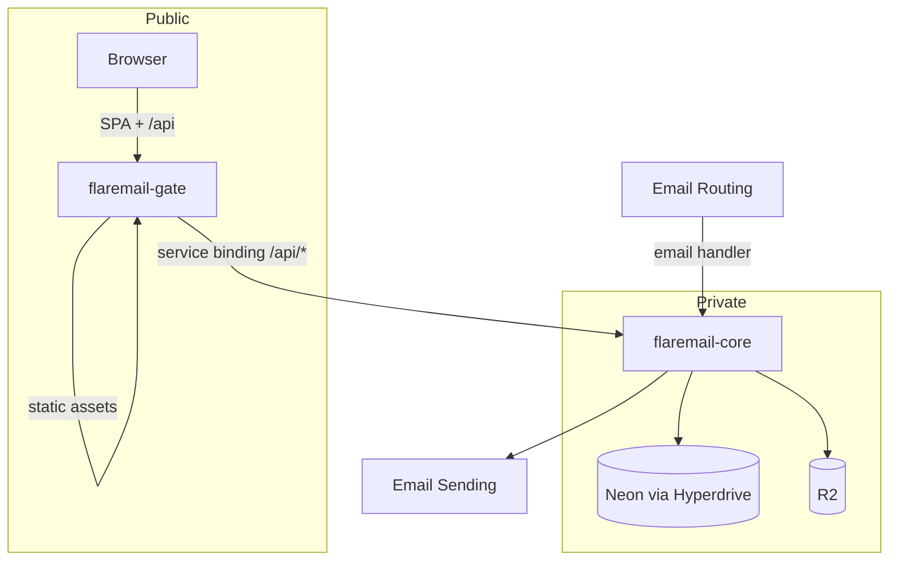

<div align="center">


# FlareMail

**Self-hosted email for your domains**

Receive catch-all mail · shared mailboxes · web UI · versioned HTTP API

**v1.0.0** — first stable release.

[](./package.json)
[](./LICENSE)
[](https://developers.cloudflare.com/workers/)
[](https://neon.tech/)
[](./apps/web)

[Docs](./docs/README.md) · [Changelog](./CHANGELOG.md) · [API](./docs/API.md) · [Glossary](./docs/CONTEXT.md) · [Security](./SECURITY.md) · [License](./LICENSE) · [CLI](./apps/cli/README.md) · [Core](./apps/core/README.md) · [Gate](./apps/gate/README.md) · [Web](./apps/web/README.md)

</div>

---

## Why Flaremail

You keep the mailbox data. Cloudflare carries inbound/outbound mail and edge compute. Neon holds metadata. Configure and ship an **instance** with the **CLI** — one `flaremail.conf.jsonc`, not scattered Wrangler and dotenv files.

| You get | Built on |
|---------|----------|
| Catch-all inbound + send/reply/forward | Email Routing + Email Sending |
| Threads, labels, shared mailboxes | Neon + R2 |
| Session, API keys, OIDC IdP | Workers |
| Day-to-day mail UI | React SPA on **gate** |

| Role | Jump to |
|------|---------|
| Installing operator | [Install](#install) · [CLI](./apps/cli/README.md) |
| Developer / maintainer | [Develop](#develop) |
| Everyone | [Architecture](#architecture) · [Glossary](./docs/CONTEXT.md) |

---

## Architecture



| Package | Cloudflare | Role |
|---------|------------|------|
| [`apps/cli`](./apps/cli) | — | Operator CLI — config, health, deploy |
| [`apps/web`](./apps/web) | *(source only)* | React / Vite UI |
| [`apps/gate`](./apps/gate) | `flaremail-gate` | Public edge — SPA + `/api` proxy |
| [`apps/core`](./apps/core) | `flaremail-core` | Email, API, crons, bindings |

**Domain** = mail domain in Flaremail (e.g. `acme.com`).  
**Gate hostname** = public host on gate (e.g. `mail.acme.com`).

Browsers talk only to the gate hostname; `/api` is proxied to core (same-origin cookies). Details: [ADR-0010](./docs/adr/0010-gate-and-private-core.md). Instance config: [ADR-0012](./docs/adr/0012-cli-instance-config.md).

<details>
<summary><strong>Request paths</strong></summary>

**Web + API**

1. User opens the **gate hostname**.
2. Gate serves the SPA (SPA fallback for client routes).
3. SPA calls `/api/v1/...` on the same origin.
4. Gate forwards `/api/*` → `env.CORE.fetch(request)`.
5. Core authenticates and handles the request.

**Inbound mail**

1. Email Routing delivers to Cloudflare.
2. Catch-all (or address rule) → Worker **`flaremail-core`**.
3. Core resolves mailbox, stores Postgres + R2, updates threads.

**Outbound mail**

1. UI/API send, reply, forward, or draft-send on `/api/v1`.
2. Core builds MIME → Email Sending; persists the sent message.

**Scheduled**

Core cron (`*/2 * * * *`) — domain-validation timeouts, log retention.

</details>

<details>
<summary><strong>Monorepo layout</strong></summary>

```
apps/
  cli/      Operator CLI (TUI + commands)
  core/     Private Worker — email, API, DB, R2, Hyperdrive
  gate/     Public Worker — SPA assets + /api proxy
  web/      React SPA source (built into gate)
  3p-demo/  Optional OIDC relying-party demo
packages/   Shared libraries (api-errors, i18n, identity-name-pattern, local-part-policy, mail-quoting, mail-search-query, email-html-prepare)
docs/       Glossary, ADRs, API, auth specs
```

| Layer | Technology |
|-------|------------|
| Edge | Cloudflare Workers (gate + core) |
| Mail | Email Routing + Email Sending |
| DB | Neon Postgres via Hyperdrive + Drizzle |
| Blobs | R2 |
| UI | React, Vite, TanStack Query, TipTap |

</details>

---

## Install

You need a **Cloudflare** account, a **Neon** project, and **Node.js 22+**. Full command reference: [`apps/cli`](./apps/cli/README.md).

```bash
git clone https://github.com/eranova-digital/flaremail.git
cd flaremail
npm install
npx flaremail init
npx flaremail deploy --yes
```

Then **immediately** open `https://<gate-hostname>/bootstrap` and complete **first-claimer** bootstrap. Until that succeeds, anyone who can reach the **gate hostname** can claim the **instance**. Store the password shown once. Procedure: [`docs/first-claimer-bootstrap.md`](./docs/first-claimer-bootstrap.md). Security: [`SECURITY.md`](./SECURITY.md).

`flaremail.conf.jsonc` is the only **instance** file (gitignored). Do not edit generated `.env` or `wrangler.jsonc`. TTY: `npx flaremail` for the TUI.

**Update**

```bash
git pull
npm install            # if package-lock.json changed
npx flaremail deploy --yes
```

Drift: `npx flaremail doctor` then `npx flaremail apply --yes`.

Push to `master` deploys production via GitHub Actions (`npx flaremail deploy --yes`). Details: [`apps/cli`](./apps/cli/README.md#ci).

---

## Develop

**Recommended:** UI against a **deployed** gate.

```bash
npx flaremail sync
npm run web:dev
```

Local email is unreliable — use deployed core for mail-path tests.

Optional local Workers: `npx flaremail dev` then `npm run web:dev`.

| Concern | Start here |
|---------|------------|
| Instance config / deploy | [`apps/cli`](./apps/cli/README.md) |
| HTTP / OpenAPI | [`apps/core`](./apps/core/README.md) |
| Mail in/out | `apps/core` — `email()` + `services/outbound-mail` |
| Public edge | [`apps/gate`](./apps/gate/README.md) |
| UI | [`apps/web`](./apps/web/README.md) |
| Terms | [`docs/CONTEXT.md`](./docs/CONTEXT.md) |
| Decisions | [`docs/adr/`](./docs/adr/) |

Schema: edit `apps/core/src/db/schema.ts` → `npm run db:generate` → review → `npx flaremail deploy --core --yes`.  
OpenAPI: edit `apps/core/openapi.yaml` → `npm run apigen`.

Auth design: [`docs/specs/auth/`](./docs/specs/auth/). Agents: [`AGENTS.md`](./AGENTS.md).

| Command | Description |
|---------|-------------|
| `npx flaremail` | TUI |
| `npx flaremail init` / `sync` / `status` / `doctor` / `apply` / `deploy` / `dev` | CLI |
| `npm run deploy` / `dev` | Aliases for `flaremail deploy --yes` / `flaremail dev` |
| `npm run core:deploy` / `gate:deploy` | Aliases for `flaremail deploy --core/--gate --yes` |
| `npm run web:dev` / `web:test` / `core:test` | UI and Worker tests |
| `npm run db:*` / `apigen` / `typegen` | Schema and codegen |

---

## License

FlareMail is source-available under the [FlareMail Source-Available License](./LICENSE)
(© 2026 EXAGROUP S.R.L.). You may use, modify, and self-host it. Paid deployment,
hosting, and managed offerings of FlareMail (or forks still recognizable as
FlareMail) require written authorization from the Licensor. Independently
distinct derivatives that are no longer recognizable as FlareMail may offer
those services without that authorization, without using FlareMail branding.

---

<div align="center">

<sub>Built for operators who want mail on their own domains — without giving up the data.</sub>

</div>
