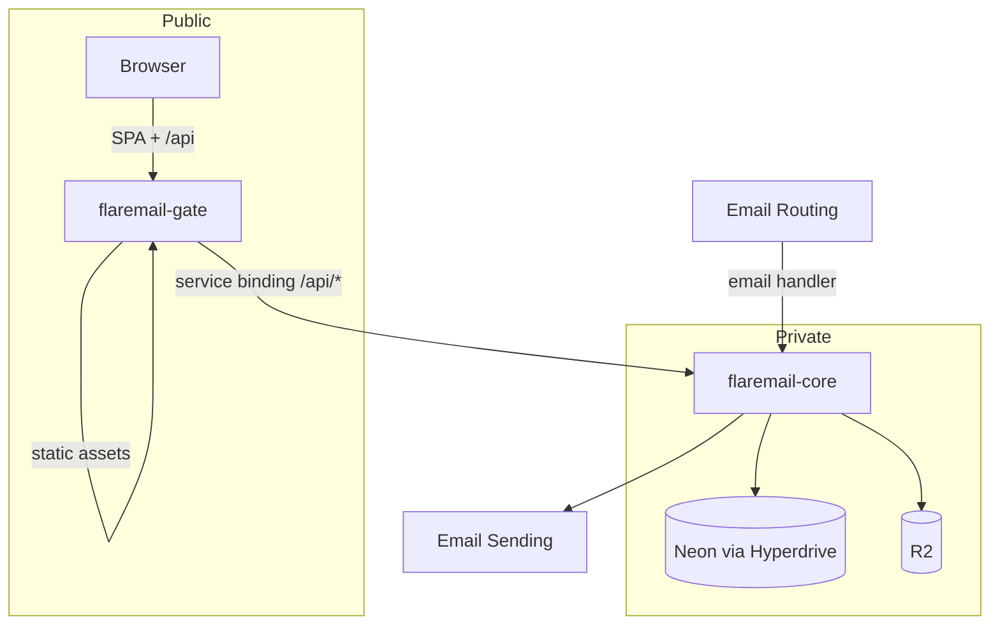

<div align="center">


# FlareMail

**Self-hosted email for your domains**

Receive catch-all mail · shared mailboxes · web UI · versioned HTTP API

**v0.9.6** — locale-aware dates and calendar, plus UI polish across auth, mail, and settings.

[](./package.json)
[](./LICENSE)
[](https://developers.cloudflare.com/workers/)
[](https://neon.tech/)
[](./apps/web)

[Docs](./docs/README.md) · [API](./docs/API.md) · [Glossary](./docs/CONTEXT.md) · [License](./LICENSE) · [CLI](./apps/cli/README.md) · [Core](./apps/core/README.md) · [Gate](./apps/gate/README.md) · [Web](./apps/web/README.md)

</div>

---

## Why Flaremail

You keep the mailbox data. Cloudflare carries inbound/outbound mail and edge compute. Neon holds metadata. The **CLI** (`npx flaremail`) is the operator entry: one `flaremail.conf.jsonc` drives config, health, and deploy of a private **core** Worker and a public **gate**.

| You get | Built on |
|---------|----------|
| Catch-all inbound + send/reply/forward | Email Routing + Email Sending |
| Threads, labels, shared mailboxes | Neon + R2 |
| Session, API keys, OIDC IdP | Workers |
| Day-to-day mail UI | React SPA on **gate** |

**Who this README is for**

| Role | Jump to |
|------|---------|
| IT / installing operator | [Install](#for-installing-operators) · [Update](#updating-an-existing-install) |
| Developer / maintainer | [Develop](#for-developers--maintainers) |
| Everyone | [Architecture](#architecture) · [Glossary](./docs/CONTEXT.md) |

---

## Table of contents

- [Architecture](#architecture)
- [For installing operators](#for-installing-operators)
  - [First-time setup](#first-time-setup)
  - [Updating an existing install](#updating-an-existing-install)
- [For developers & maintainers](#for-developers--maintainers)
  - [Development flow](#development-flow)
  - [Deployment flow](#deployment-flow)
  - [Scripts](#scripts-reference)

---

## Architecture



| Package | Cloudflare | Role |
|---------|------------|------|
| [`apps/web`](./apps/web) | *(source only)* | React / Vite UI |
| [`apps/gate`](./apps/gate) | `flaremail-gate` | Public edge — SPA + `/api` proxy |
| [`apps/core`](./apps/core) | `flaremail-core` | Email, API, crons, bindings |

**Domain** = mail domain in Flaremail (e.g. `acme.com`).  
**Gate hostname** = public host on gate (e.g. `mail.acme.com`).

Browsers talk only to the gate hostname; `/api` is proxied to core (same-origin cookies). Details: [ADR-0010](./docs/adr/0010-gate-and-private-core.md).

<details>
<summary><strong>Request paths</strong></summary>

**Web + API**

1. User opens the **gate hostname**.
2. Gate serves the SPA (SPA fallback for client routes).
3. SPA calls `/api/v1/...` on the same origin.
4. Gate forwards `/api/*` → `env.CORE.fetch(request)`.
5. Core authenticates and handles the request.

**Inbound mail**

1. Email Routing delivers to Cloudflare.
2. Catch-all (or address rule) → Worker **`flaremail-core`**.
3. Core resolves mailbox, stores Postgres + R2, updates threads.

**Outbound mail**

1. UI/API send, reply, forward, or draft-send on `/api/v1`.
2. Core builds MIME → Email Sending; persists the sent message.

**Scheduled**

Core cron (`*/2 * * * *`) — domain-validation timeouts, log retention.

</details>

<details>
<summary><strong>Monorepo layout</strong></summary>

```
apps/
  cli/      Operator CLI (TUI + commands) — instance config, health, deploy
  core/     Private Worker — email, API, DB, R2, Hyperdrive
  gate/     Public Worker — SPA assets + /api proxy
  web/      React SPA source (built into gate)
  3p-demo/  Optional OIDC relying-party demo
packages/   Shared libraries (i18n, mail quoting, …)
docs/       Glossary, ADRs, API, auth specs
```

| Layer | Technology |
|-------|------------|
| Edge | Cloudflare Workers (gate + core) |
| Mail | Email Routing + Email Sending |
| DB | Neon Postgres via Hyperdrive + Drizzle |
| Blobs | R2 |
| UI | React, Vite, TanStack Query, TipTap |

</details>

---

## For installing operators

Deploy and run an instance. You need a **Cloudflare** account, a **Neon** project, and **Node.js 20+**.

### First-time setup

#### 1. Clone and install

```bash
git clone https://github.com/pxtrickb/flaremail.git
cd flaremail
npm install
```

Create a [Cloudflare API token](https://developers.cloudflare.com/fundamentals/api/get-started/create-token/) with Workers, Hyperdrive, R2, Email Routing, and zone DNS read. You can also `npx wrangler login` for Wrangler-only steps; health/apply still need the token.

#### 2. Instance config

1. Create a Neon project and copy the **direct** Postgres URL (not the serverless HTTP endpoint).
2. Run the wizard (generates secrets, writes gitignored `flaremail.conf.jsonc`, and materializes `.env` / `wrangler.jsonc`):

```bash
npx flaremail init
```

Or copy [`flaremail.conf.example.jsonc`](./flaremail.conf.example.jsonc) → `flaremail.conf.jsonc` and edit, then `npx flaremail sync`.

> [!IMPORTANT]
> `flaremail.conf.jsonc` is the only **instance** file. Do not commit it. The CLI writes `apps/core/.env`, `apps/web/.env`, and both `wrangler.jsonc` files — those are gitignored too ([ADR-0012](./docs/adr/0012-cli-instance-config.md)).
>
> `DATABASE_URL` is for migrations and local core only. It is **never** uploaded to Cloudflare.

> [!TIP]
> Hyperdrive query caching stays off. Cached `SELECT`s make list views look stale after writes. `flaremail apply` / `deploy` creates Hyperdrive with caching disabled.

#### 3. Deploy

```bash
npx flaremail deploy --yes
# or: npm run deploy
```

1. Materialize files from conf; create/repair Hyperdrive, R2, Email Routing catch-alls, gate custom domain
2. **core** — migrate DB → upload only `SESSION_SECRET` + `OIDC_SIGNING_JWK` → deploy `flaremail-core` (no public `workers.dev` / Preview URLs)
3. **gate** — build `apps/web` → deploy `flaremail-gate` with assets + service binding to core

Core must exist before gate (binding target). List mail **Domains** in conf `mailDomains` so catch-all → **core** is applied. Outbound SPF/DKIM is checked by `flaremail doctor` but not rewritten automatically.

TTY: `npx flaremail` opens a TUI (`d` doctor, `a` apply, `p` deploy).

#### 4. First sign-in

Open the **gate hostname**. Complete intendant bootstrap if prompted ([ADR-0005](./docs/adr/0005-intendant-break-glass-account.md)). Add domains and mailboxes in Settings.

Production does not need a separate static host — **gate** serves the SPA.

GitHub Actions: set repo secrets `FLAREMAIL_CONF` (full jsonc) and `CLOUDFLARE_API_TOKEN`. `main` deploys via the production environment; `development` via staging.

### Updating an existing install

```bash
cd flaremail
git pull origin main   # or your tracked branch
npm install            # if package-lock.json changed
npx flaremail deploy --yes
```

| Situation | What to do |
|-----------|------------|
| Schema / API release | `npx flaremail deploy --yes` (migrations included) |
| Only secrets / gate hostname | Edit `flaremail.conf.jsonc` → `npx flaremail deploy --core --yes` |
| Only UI | `npx flaremail deploy --gate --yes` |
| Drift (resources exist but misconfigured) | `npx flaremail doctor` then `npx flaremail apply --yes` |
| Emergency code revert | Redeploy an older git SHA, or CF Worker version rollback |

Email Routing only needs a conf/`apply` change if the **core** Worker name changes (it should stay `flaremail-core`).

---

## For developers & maintainers

### Development flow

**Recommended:** UI against a **deployed** gate.

```bash
npx flaremail sync    # writes apps/web/.env from conf
npm run web:dev
```

Local email is unreliable — use deployed core for mail-path tests.

<details>
<summary><strong>Optional full local Workers</strong></summary>

```bash
npm run dev          # core:dev + gate:dev
npm run web:dev      # API_PROXY_TARGET=http://localhost:8787
```

| Command | Purpose |
|---------|---------|
| `npm run core:dev` | Core + local Hyperdrive stub from `DATABASE_URL` |
| `npm run gate:dev` | Gate on `:8787` |
| `npm run core:test` / `web:test` | Vitest |
| `npm run apigen` | OpenAPI JSON + web client |
| `npm run typegen` | Core Wrangler types |
| `npm run db:*` | Drizzle via `apps/core` |

Schema: edit `apps/core/src/db/schema.ts` → `npm run db:generate` → review → migrate (or deploy).  
OpenAPI: edit `apps/core/openapi.yaml` → `npm run apigen`.

</details>

### Deployment flow

```bash
npm run deploy                 # flaremail deploy --yes
npm run core:deploy            # core only
npm run gate:deploy            # web build + gate
npx flaremail doctor           # health vs conf
npx flaremail apply --yes      # repair CF resources, no code push
```

Secrets uploaded are `SESSION_SECRET` and `OIDC_SIGNING_JWK` only — never `DATABASE_URL`.

### Where to change what

| Concern | Start here |
|---------|------------|
| Instance config / deploy | [`apps/cli`](./apps/cli/README.md) |
| HTTP / OpenAPI | [`apps/core`](./apps/core/README.md) |
| Mail in/out | `apps/core` — `email()` + `services/outbound-mail` |
| Public edge | [`apps/gate`](./apps/gate/README.md) |
| UI | [`apps/web`](./apps/web/README.md) |
| Terms | [`docs/CONTEXT.md`](./docs/CONTEXT.md) |
| Decisions | [`docs/adr/`](./docs/adr/) |

Auth design: [`docs/specs/auth/`](./docs/specs/auth/). Agents: [`AGENTS.md`](./AGENTS.md) (fetch current Cloudflare docs).

### Scripts reference

| Command | Description |
|---------|-------------|
| `npx flaremail` | TUI (TTY) |
| `npx flaremail init` / `sync` / `doctor` / `apply` / `deploy` | Operator commands |
| `npm run deploy` | `flaremail deploy --yes` |
| `npm run dev` | `flaremail dev` (local core + gate) |
| `npm run core:dev` / `core:deploy` / `core:test` | Core lifecycle |
| `npm run gate:dev` / `gate:deploy` | Gate lifecycle |
| `npm run web:dev` / `web:build` / `web:test` | Web lifecycle |
| `npm run db:migrate` / `db:generate` / `db:studio` | Database |
| `npm run apigen` / `typegen` | Codegen |

---

## License

FlareMail is source-available under the [FlareMail Source-Available License](./LICENSE)
(© 2026 EXAGROUP S.R.L.). You may use, modify, and self-host it. Paid deployment,
hosting, and managed offerings of FlareMail (or forks still recognizable as
FlareMail) require written authorization from the Licensor. Independently
distinct derivatives that are no longer recognizable as FlareMail may offer
those services without that authorization, without using FlareMail branding.

---

<div align="center">

<sub>Built for operators who want mail on their own domains — without giving up the data.</sub>

</div>
