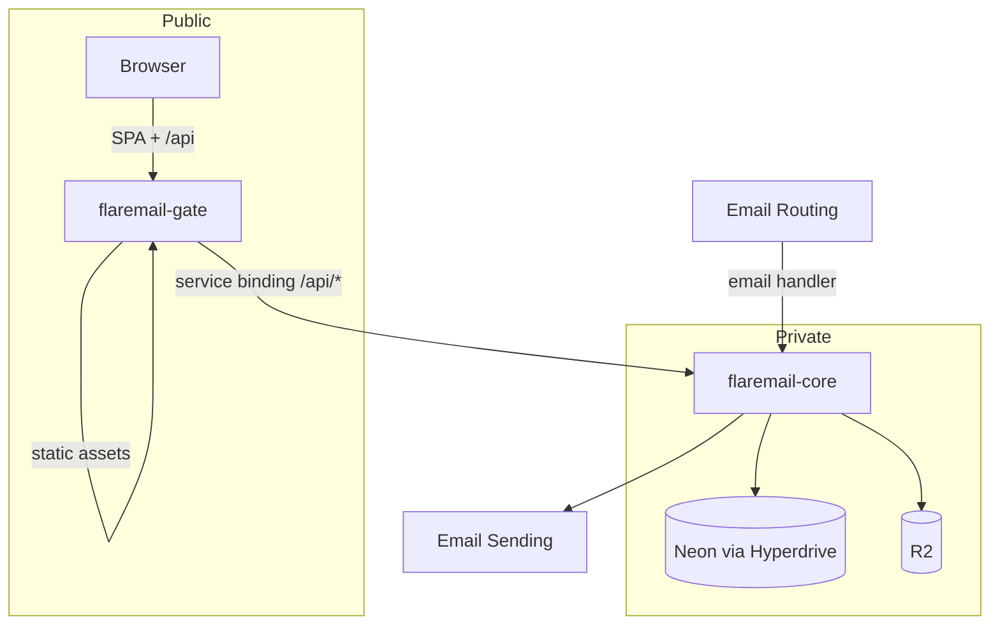

<div align="center">


# Flaremail

**Self-hosted email for your domains**

Receive catch-all mail · shared mailboxes · web UI · versioned HTTP API

**v0.9.5** — responsive mobile UI, inbound BIMI brand marks, and a refactored drafts system.

[](./package.json)
[](https://developers.cloudflare.com/workers/)
[](https://neon.tech/)
[](./apps/web)

[Docs](./docs/README.md) · [API](./docs/API.md) · [Glossary](./docs/CONTEXT.md) · [Core](./apps/core/README.md) · [Gate](./apps/gate/README.md) · [Web](./apps/web/README.md)

</div>

---

## Why Flaremail

You keep the mailbox data. Cloudflare carries inbound/outbound mail and edge compute. Neon holds metadata. One `npm run deploy` ships a private **core** Worker and a public **gate** that serves the UI and proxies `/api`.

| You get | Built on |
|---------|----------|
| Catch-all inbound + send/reply/forward | Email Routing + Email Sending |
| Threads, labels, shared mailboxes | Neon + R2 |
| Session, API keys, OIDC IdP | Workers |
| Day-to-day mail UI | React SPA on **gate** |

**Who this README is for**

| Role | Jump to |
|------|---------|
| IT / installing operator | [Install](#for-installing-operators) · [Update](#updating-an-existing-install) |
| Developer / maintainer | [Develop](#for-developers--maintainers) |
| Everyone | [Architecture](#architecture) · [Glossary](./docs/CONTEXT.md) |

---

## Table of contents

- [Architecture](#architecture)
- [For installing operators](#for-installing-operators)
  - [First-time setup](#first-time-setup)
  - [Updating an existing install](#updating-an-existing-install)
- [For developers & maintainers](#for-developers--maintainers)
  - [Development flow](#development-flow)
  - [Deployment flow](#deployment-flow)
  - [Scripts](#scripts-reference)

---

## Architecture



| Package | Cloudflare | Role |
|---------|------------|------|
| [`apps/web`](./apps/web) | *(source only)* | React / Vite UI |
| [`apps/gate`](./apps/gate) | `flaremail-gate` | Public edge — SPA + `/api` proxy |
| [`apps/core`](./apps/core) | `flaremail-core` | Email, API, crons, bindings |

**Domain** = mail domain in Flaremail (e.g. `acme.com`).  
**Gate hostname** = public host on gate (e.g. `mail.acme.com`).

Browsers talk only to the gate hostname; `/api` is proxied to core (same-origin cookies). Details: [ADR-0010](./docs/adr/0010-gate-and-private-core.md).

<details>
<summary><strong>Request paths</strong></summary>

**Web + API**

1. User opens the **gate hostname**.
2. Gate serves the SPA (SPA fallback for client routes).
3. SPA calls `/api/v1/...` on the same origin.
4. Gate forwards `/api/*` → `env.CORE.fetch(request)`.
5. Core authenticates and handles the request.

**Inbound mail**

1. Email Routing delivers to Cloudflare.
2. Catch-all (or address rule) → Worker **`flaremail-core`**.
3. Core resolves mailbox, stores Postgres + R2, updates threads.

**Outbound mail**

1. UI/API send, reply, forward, or draft-send on `/api/v1`.
2. Core builds MIME → Email Sending; persists the sent message.

**Scheduled**

Core cron (`*/2 * * * *`) — domain-validation timeouts, log retention.

</details>

<details>
<summary><strong>Monorepo layout</strong></summary>

```
apps/
  core/     Private Worker — email, API, DB, R2, Hyperdrive
  gate/     Public Worker — SPA assets + /api proxy
  web/      React SPA source (built into gate)
  3p-demo/  Optional OIDC relying-party demo
packages/   Shared libraries (i18n, mail quoting, …)
docs/       Glossary, ADRs, API, auth specs
```

| Layer | Technology |
|-------|------------|
| Edge | Cloudflare Workers (gate + core) |
| Mail | Email Routing + Email Sending |
| DB | Neon Postgres via Hyperdrive + Drizzle |
| Blobs | R2 |
| UI | React, Vite, TanStack Query, TipTap |

</details>

---

## For installing operators

Deploy and run an instance. You need a **Cloudflare** account, a **Neon** project, and **Node.js 20+**.

### First-time setup

#### 1. Clone and install

```bash
git clone https://github.com/pxtrickb/flaremail.git
cd flaremail
npm install
npx wrangler login
```

#### 2. Neon database

1. Create a Neon project.
2. Copy the **direct** Postgres URL (not the serverless HTTP endpoint).
3. Create env:

```bash
cp apps/core/.env.example apps/core/.env
```

4. Set `DATABASE_URL` in `apps/core/.env`.

> [!IMPORTANT]
> There is **no root `.env`**. Secrets and `DATABASE_URL` live only in `apps/core/.env`. Never commit `.env`.

#### 3. Hyperdrive

```bash
npx wrangler hyperdrive create flaremail-db \
  --connection-string="<your-neon-direct-url>"

npx wrangler hyperdrive update <HYPERDRIVE_ID> --caching-disabled true
```

Put the Hyperdrive **id** in `apps/core/wrangler.jsonc` (replace the sample). The id is account-specific, not a secret — using it still requires your Cloudflare account.

> [!TIP]
> Disable query caching. Cached `SELECT`s make list views look stale after writes.

#### 4. Secrets and vars

In `apps/core/.env`:

| Variable | Purpose |
|----------|---------|
| `DATABASE_URL` | Direct Neon URL — migrations + local core only (**never** uploaded to CF) |
| `SESSION_SECRET` | Long random secret for session cookies |
| `OIDC_SIGNING_JWK` | One-line ES256 private JWK ([ADR-0007](./docs/adr/0007-oidc-token-signing-es256.md)) |

```bash
node -e "const {generateKeyPairSync}=require('crypto');const {exportJWK}=require('jose');(async()=>{const {privateKey}=generateKeyPairSync('ec',{namedCurve:'P-256'});const jwk=await exportJWK(privateKey);jwk.kid='flaremail';jwk.alg='ES256';jwk.use='sig';console.log(JSON.stringify(jwk))})()"
```

In `apps/core/wrangler.jsonc` → `vars.WEB_ORIGIN`, set your final **gate hostname** URL (e.g. `https://mail.example.com`).

#### 5. Deploy

```bash
npm run deploy
```

1. **core** — migrate DB → upload only `SESSION_SECRET` + `OIDC_SIGNING_JWK` → deploy `flaremail-core` (no public `workers.dev` / Preview URLs)
2. **gate** — build `apps/web` → deploy `flaremail-gate` with assets + service binding to core

Core must exist before gate (binding target). R2 can be provisioned from core’s wrangler config.

#### 6. Gate hostname

Cloudflare dashboard → Workers → **flaremail-gate** → add your custom domain.

If you change `WEB_ORIGIN`, redeploy core:

```bash
npm run core:deploy
```

#### 7. Email Routing and Sending

For each mail **Domain** (e.g. `acme.com`):

1. Enable **Email Routing**.
2. Catch-all → **Send to a Worker** → **`flaremail-core`**.
3. Configure **Email Sending** DNS for outbound.

Deploy Workers first, then point Email Routing at core, then attach the gate hostname (or in parallel once gate exists).

#### 8. First sign-in

Open the **gate hostname**. Complete intendant bootstrap if prompted ([ADR-0005](./docs/adr/0005-intendant-break-glass-account.md)). Add domains and mailboxes in Settings.

Optional local UI against the deployed stack:

```bash
cp apps/web/.env.example apps/web/.env
# API_URL=/api/v1
# API_PROXY_TARGET=https://your-gate-hostname
```

Production does not need a separate static host — **gate** serves the SPA.

### Updating an existing install

```bash
cd flaremail
git pull origin main   # or your tracked branch
npm install            # if package-lock.json changed
npm run deploy         # migrate + core + web build + gate
```

| Situation | What to do |
|-----------|------------|
| Schema / API release | `npm run deploy` (migrations run in `core:deploy`) |
| Only secrets / `WEB_ORIGIN` | Edit `.env` or wrangler → `npm run core:deploy` |
| Only UI | `npm run gate:deploy` |
| Upstream wrangler / Hyperdrive edits | Merge, keep your Hyperdrive id + secrets, redeploy |
| Emergency code revert | Redeploy an older git SHA, or CF Worker version rollback |

Email Routing only needs a change if the **core** Worker name changes (it should stay `flaremail-core`).

---

## For developers & maintainers

### Development flow

**Recommended:** UI against a **deployed** gate.

```bash
cp apps/web/.env.example apps/web/.env
# API_PROXY_TARGET=https://your-gate-hostname
npm run web:dev
```

Local email is unreliable — use deployed core for mail-path tests.

<details>
<summary><strong>Optional full local Workers</strong></summary>

```bash
npm run dev          # core:dev + gate:dev
npm run web:dev      # API_PROXY_TARGET=http://localhost:8787
```

| Command | Purpose |
|---------|---------|
| `npm run core:dev` | Core + local Hyperdrive stub from `DATABASE_URL` |
| `npm run gate:dev` | Gate on `:8787` |
| `npm run core:test` / `web:test` | Vitest |
| `npm run apigen` | OpenAPI JSON + web client |
| `npm run typegen` | Core Wrangler types |
| `npm run db:*` | Drizzle via `apps/core` |

Schema: edit `apps/core/src/db/schema.ts` → `npm run db:generate` → review → migrate (or deploy).  
OpenAPI: edit `apps/core/openapi.yaml` → `npm run apigen`.

</details>

### Deployment flow

```bash
npm run deploy                 # core then gate
npm run core:deploy            # migrate + filtered secrets + core
npm run gate:deploy            # web build + gate
```

Secrets file is filtered to `secrets.required` only — never `DATABASE_URL`. See `apps/core/scripts/deploy-with-secrets.mjs`.

### Where to change what

| Concern | Start here |
|---------|------------|
| HTTP / OpenAPI | [`apps/core`](./apps/core/README.md) |
| Mail in/out | `apps/core` — `email()` + `services/outbound-mail` |
| Public edge | [`apps/gate`](./apps/gate/README.md) |
| UI | [`apps/web`](./apps/web/README.md) |
| Terms | [`docs/CONTEXT.md`](./docs/CONTEXT.md) |
| Decisions | [`docs/adr/`](./docs/adr/) |

Auth design: [`docs/specs/auth/`](./docs/specs/auth/). Agents: [`AGENTS.md`](./AGENTS.md) (fetch current Cloudflare docs).

### Scripts reference

| Command | Description |
|---------|-------------|
| `npm run deploy` | Migrate + deploy core, then build web + deploy gate |
| `npm run dev` | Local core + gate |
| `npm run core:dev` / `core:deploy` / `core:test` | Core lifecycle |
| `npm run gate:dev` / `gate:deploy` | Gate lifecycle |
| `npm run web:dev` / `web:build` / `web:test` | Web lifecycle |
| `npm run db:migrate` / `db:generate` / `db:studio` | Database |
| `npm run apigen` / `typegen` | Codegen |

---

<div align="center">

<sub>Built for operators who want mail on their own domains — without giving up the data.</sub>

</div>
